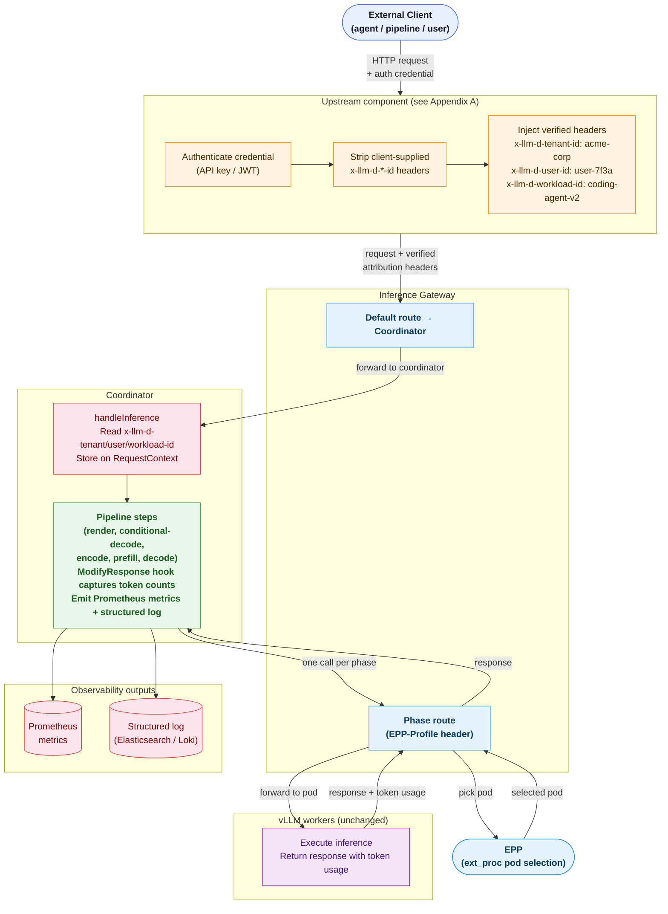

# Request Attribution Metrics — Coordinator Implementation

**Authors**: Sima Nadler (_IBM_)

**Related Issue**: [llm-d/llm-d-router#2741](https://github.com/llm-d/llm-d-router/issues/2741)

## Summary

llm-d tracks token usage and infrastructure cost per model today but has no mechanism to
attribute those costs to the **business entities** that generate them: tenants, users, and
workloads. Without this, multi-tenant platform teams cannot do chargeback, enforce
per-tenant budgets, or identify which workloads are cost-inefficient.

This proposal introduces request attribution implemented by the [coordinator](../../README.coord.md) — tagging every
inference request with a `tenant_id`, `user_id`, and `workload_id` carried in request
headers and propagating those identities through the coordinator's observability stack.

A [separate proposal](./open-cost-new-dimensions-plan-coordinator.md) describes the enhancements to OpenCost for generating inference costs per tenant, workload and user based on the new metrics described in this proposal.


## Motivation

The existing cost tracking stack ([OpenCost](https://github.com/opencost/opencost/blob/develop/docs/inference-cost-tracking.md) + vLLM metrics) answers "what does it cost to
serve model X?" It cannot answer:

- Which team or customer is responsible for that cost?
- Which application, agent, or pipeline is driving GPU spend?
- Is a specific user consuming a disproportionate share of shared infrastructure?

### Goals

The primary goal of this proposal is for llm-d to generate the metrics needed to calculate inference costs
attributed by tenant, workload, and user — enabling chargeback, per-team budget
enforcement, and cost anomaly detection without changes to vLLM, the EPP, or the
Inference Gateway.

Supporting goals:

- **Aggregate attribution** — Prometheus counters carry `tenant_id`, `workload_id`, and
  `target_model_name` labels (and optionally `user_id`) so dashboards, alerts, and OpenCost
  billing queries work without a log aggregation backend.
- **Per-request audit** — a structured JSON log record is emitted for every request,
  always including all three identity fields and token counts, as an audit aid for
  deployments where Prometheus `user_id` cardinality is disabled.
- **Zero footprint on the critical path** — attribution is opt-in, degrades gracefully
  when headers are absent, and adds no latency visible to the client.

### Non-Goals

- Replacing or deprecating `x-llm-d-inference-fairness-id`. That header governs
  flow-control scheduling in the EPP and is unchanged.
- Forwarding attribution headers to vLLM or the EPP beyond what they already carry
  through normal header forwarding.
- Implementing or specifying client authentication or authorization.
- Per-request payload inspection or body-based routing.
- Real-time budget enforcement or request admission based on spend.
- Log aggregation infrastructure. The structured log record is written to the
  coordinator's standard logger; shipping it to a log backend is the operator's
  responsibility.

### Example Use Cases

- **Workload cost comparison** — an engineering team compares two agent versions
  side-by-side to see which costs less per million tokens, directly in dollars.
- **Platform team chargeback** — a platform team bills internal product teams by querying
  per-tenant cost breakdowns at the end of each month.
- **Per-user billing with unbounded users** — a SaaS platform serves thousands of end
  users and produces per-user invoices by querying the coordinator's structured log stream
  when Prometheus label cardinality makes per-user metrics impractical.
- **Cost governance and anomaly detection** — a platform team configures alerts on
  per-tenant token consumption; when a tenant exceeds its expected monthly budget
  mid-cycle, an alert fires before the bill arrives.
- **A/B model rollout cost comparison** — during a canary rollout, querying OpenCost by
  `target_model_name` and `workload_id` shows whether the quality improvement justifies the
  higher cost per million tokens.

## Why the Coordinator

The coordinator is the single entry point for every client request in the llm-d
coordinator deployment model. It owns the full request lifecycle — from the inbound
OpenAI request through each disaggregated phase (encode → prefill → decode) to streaming
the final response — giving it natural access to attribution headers, token counts,
serving model, and end-to-end timing without any additional instrumentation hooks. It
also already has `pkg/coordinator/metrics`, a structured logger, and a `RequestContext`
that threads per-request state through the pipeline, so attribution slots in as a
first-class extension.

For a discussion of alternative components that were considered (IPP, EPP, gateway
filter, sidecar), see [Alternatives Considered](#alternatives-considered).

## Proposal

### Two Output Tiers

Attribution data is produced at two granularities:

| Tier | Mechanism | Granularity | `user_id` | Primary use case |
|---|---|---|---|---|
| **Tier 1** | Prometheus metric labels | Aggregate | Configurable | Real-time dashboards, alerting, chargeback |
| **Tier 2** | structured JSON log | Per-request, 100% | Always | Audit aid, per-user attribution |

**Tier 1 — Prometheus metric labels** are the right tool for questions like "how many
tokens did `acme-corp` consume this hour?" They feed directly into Grafana dashboards
and OpenCost billing queries. Adding `user_id` as a label on high-cardinality deployments
causes Prometheus time-series explosion, so it is controlled by a configuration gate.

**Tier 2 — Structured JSON log** is an audit aid emitted for every request. It always
includes all three identity fields and token counts. For deployments where Prometheus
`user_id` cardinality is disabled it serves as the per-user attribution record. It is
**not** an authoritative billing record: logs are subject to sampling, rotation, and
backpressure drops and are not a reliable transport for billing data. Where tracing is
enabled, per-request attribution fields (tenant, user, workload, token counts) should be
recorded as span attributes on the request trace span.

### Attribution Headers

Three request headers, all in the `x-llm-d-*` namespace:

| Header | Description | Example value |
|---|---|---|
| `x-llm-d-tenant-id` | Organizational unit responsible for the request | `acme-corp` |
| `x-llm-d-user-id` | Individual end user within the tenant | `user-7f3a` |
| `x-llm-d-workload-id` | Application, agent, or pipeline submitting the request | `coding-agent-v2` |

All three are optional. Omitted headers result in the literal value `unknown` in metric
labels and log fields.

> [!WARNING]
> **Trust Boundary**: In a production deployment, end-users must never be permitted to
> self-assert these values. These headers must be stripped from external requests and
> injected by a trusted upstream component (API gateway, identity proxy, or service mesh
> policy) based on verified credential data. See [Appendix A](#appendix-a-populating-attribution-headers-in-production).

### Coordinator Metric Labels (Aggregate Attribution)

Two new **counter** metric families are added under `llm_d_coordinator`:

| Metric | Type | Labels (always) | Labels (conditional) | Description |
|---|---|---|---|---|
| `llm_d_coordinator_request_input_tokens_attributed_total` | Counter | `model_name`, `tenant_id`, `workload_id`, `target_model_name`, `namespace` | `user_id` | Prompt tokens accumulated per attribution dimensions |
| `llm_d_coordinator_request_output_tokens_attributed_total` | Counter | `model_name`, `tenant_id`, `workload_id`, `target_model_name`, `namespace` | `user_id` | Completion tokens accumulated per attribution dimensions |

`model_name` is the requested model from the request body (same as the existing
`requestInputTokens` histogram). `target_model_name` is the model name returned by vLLM
in the decode response body — the authoritative OpenCost join key, matching the EPP label
set exactly so coordinator and EPP metrics can be joined on the served model. It may
differ from `model_name` when a model-selector rewrite is in effect. When
`target_model_name` is unavailable (error path, non-streaming response body not yet
parsed), it defaults to `model_name`.

`namespace` is the Kubernetes namespace of the coordinator pod. Emitting `namespace` from
the coordinator itself ensures the label is always present with the correct value
regardless of how Prometheus is configured to scrape the endpoint. It also enables the
`target_model_name:namespace` composite join key used by OpenCost to partition
dimension-token data per deployment when multiple coordinators run in different
namespaces on a shared cluster.

`tenant_id` and `workload_id` are always present as labels. Both are header-driven with
no closed set; they **must** be routed through the coordinator's existing
[`BoundedLabel`](../../pkg/coordinator/metrics/cardinality.go) mechanism, exactly as
`model_name` is today.

**How `BoundedLabel` works.** Each label dimension gets its own
[`BoundedLabel`](../../pkg/coordinator/metrics/cardinality.go) instance (a
thread-safe, in-memory admitted set) initialised once at process startup. When a
request arrives:

1. If the value has been seen before, it passes through unchanged.
2. If the value is new and the admitted set has fewer than 1 000 entries, it is
   admitted and passes through unchanged.
3. If the admitted set is already at 1 000 entries, the value is folded to the
   sentinel `"other"` — the request is still recorded; only its label value changes.

`BoundedLabel` caps the number of distinct values admitted **per label
dimension** at 1 000. It does **not** cap the total number of time series, which
is the cross-product of distinct values across all dimensions. With four
independently bounded dimensions (`model_name`, `tenant_id`, `workload_id`,
`target_model_name`) the worst-case series count on
`llm_d_coordinator_request_input_tokens_attributed_total` is on the order of
1 000⁴. All four dimensions are influenced by client-supplied input (three
headers plus the request body), so a single client can drive the product upward
without any individual per-dimension cap ever being reached.

The per-dimension caps therefore guard against noise and unbounded *distinct
value* growth, not against cross-dimensional series explosion. The same cap
(`maxModelLabelValues = 1 000`) is already in use for `model_name` and for the
EPP's `fairness_id` label.

`user_id` is **conditionally** included, controlled by coordinator configuration:

```yaml
request_attribution:
  enabled: true
  prometheus_user_id_label: false  # default: false (safe by default)
                                   # set true only for deployments with a bounded,
                                   # known requestor population (service accounts,
                                   # teams, named integrations)
```

> [!WARNING]
> **Cardinality**: `tenant_id`, `workload_id`, and `target_model_name` are header- or
> body-sourced with no closed set. All three are bounded per dimension by `BoundedLabel`
> (cap 1 000 each), which limits the number of distinct values admitted for each label
> individually. It does **not** limit the total number of time series: Prometheus series
> count is the product across co-occurring label values. With four client-influenced
> dimensions the worst-case series count is on the order of 1 000⁴ — a single client
> with arbitrary header values can exhaust memory without any individual cap being
> exceeded. Deployments that do not enforce attribution headers from a trusted upstream
> (e.g. a gateway or service mesh that injects them) should either lower the per-dimension
> caps or disable the attributed metric families entirely and rely on the structured log
> for per-request attribution. `user_id` is **not** passed through `BoundedLabel`: when
> `prometheus_user_id_label: false` (the default) the label is absent entirely, and when
> `true` the operator has asserted a bounded, known requestor population. Do **not**
> enable `prometheus_user_id_label` for public-facing deployments with unbounded end-user
> populations. Per-user attribution remains fully available via the structured log
> regardless of this setting.

The existing `llm_d_coordinator_request_input_tokens` (model-only label,
measured after render) is **not changed**. The new attributed counters are additive.
OpenCost queries the new counters using a delta (`increase`) pattern described in
[`open-cost-new-dimensions-plan-coordinator.md`](open-cost-new-dimensions-plan-coordinator.md).

### Structured Log Record (Per-Request Audit)

A structured JSON record is emitted by the coordinator at request completion for **every
request**, regardless of Prometheus label configuration. This record is an **audit aid**,
not an authoritative billing record: logs are subject to sampling, rotation, and
backpressure drops and are not a reliable transport for billing data. Where tracing is
enabled, per-request attribution fields should be recorded as span attributes on the
request trace span instead of (or in addition to) the log record.

```json
{
  "level": "info",
  "ts": "2025-07-01T14:23:01.123Z",
  "logger": "coordinator.attribution",
  "msg": "request.complete",
  "tenant_id": "acme-corp",
  "user_id": "user-7f3a",
  "workload_id": "coding-agent-v2",
  "requested_model": "Qwen3-32B",
  "target_model_name": "Qwen3-32B",
  "namespace": "llm-d",
  "prompt_tokens": 128,
  "completion_tokens": 512,
  "request_id": "req-abc123"
}
```

- **Always includes `user_id`** in the log record, even when `prometheus_user_id_label: false` suppresses the label from the Prometheus metric.
- **`requested_model`** is the value from the request body; **`target_model_name`** is
  the value from the decode response body (defaults to `requested_model` on error paths),
  stored as `RequestContext.TargetModelName` and emitted under the same key in both the
  Prometheus label and the log record.
- **`namespace`** is the Kubernetes namespace of the coordinator pod, populated from the
  `COORDINATOR_NAMESPACE` environment variable (defaults to `default` when absent).
- Is emitted at `INFO` level on the `coordinator.attribution` logger.
- Does **not** include request or response body content — metadata only.

## Design Details

### Architecture



> The metric are generated synchronously **after the response is returned to the client**. The reasons for this approach are described in
> [Appendix B: Synchronous vs. Asynchronous Emission](#appendix-b-synchronous-vs-asynchronous-emission).

### Where Attribution Data Lives on `RequestContext`

Three fields are added to [`pkg/coordinator/pipeline/context.go`](../../pkg/coordinator/pipeline/context.go):

```go
// Attribution holds the three identity dimensions extracted from inbound
// x-llm-d-*-id headers. Values default to "unknown" when the header is absent.
// Set once by handleInference before the pipeline runs; read-only thereafter.
TenantID   string
UserID     string
WorkloadID string
```

One additional field is set in `handleInference` from the request headers; two more are
populated by the attribution hook after the response is received:

```go
// TargetModelName is the model name reported in the decode response body.
// Populated by the attribution hook from the "model" field of the decode
// response body, falling back to RequestContext.Model when the body is
// unavailable or unparseable.
//
// Known limitation: in EPP deployments the EPP rewrites the response body
// "model" field back to the client-facing name before forwarding, so
// TargetModelName reports the requested model rather than the served one.
TargetModelName string

// CompletionTokens is the completion token count from the decode response body.
// Populated by the attribution hook from the vLLM "usage.completion_tokens" field.
// Zero when the decode response body was unavailable or unparseable.
CompletionTokens int

// PromptTokensFromBody is the prompt token count read from the decode response body's
// usage.prompt_tokens field. Used when the render step is not in the pipeline and
// len(TokenIDs) is zero. Populated by the attribution hook.
PromptTokensFromBody int
```

### `handleInference`

#### Header extraction

In [`pkg/coordinator/server/handlers.go`](../../pkg/coordinator/server/handlers.go),
after the `RequestContext` is constructed, all four attribution fields are extracted
inside the `Enabled` gate. `TargetModelName` is only consumed by the attribution hook's
`Emit` and has no other use in the pipeline, so gating it alongside the identity fields
is correct:

```go
if s.attributionCfg.Enabled {
    reqCtx.TenantID   = attributionHeader(r.Header, "x-llm-d-tenant-id")
    reqCtx.UserID     = attributionHeader(r.Header, "x-llm-d-user-id")
    reqCtx.WorkloadID = attributionHeader(r.Header, "x-llm-d-workload-id")
}
```

`TargetModelName` is not set here. It is populated by the attribution hook from the
`"model"` field of the decode response body, falling back to `RequestContext.Model`
when the body is unavailable or unparseable.

Known limitation: in EPP deployments the EPP rewrites the response body `"model"` field
back to the client-facing name before the response is forwarded, so the body reports the
requested model rather than the served one. Resolving this requires the EPP to publish
the rewrite target on the response, which is out of scope for this proposal.

Where `attributionHeader` is a small helper that returns the header value or `"unknown"`:

```go
func attributionHeader(h http.Header, key string) string {
    if v := h.Get(key); v != "" {
        return v
    }
    return "unknown"
}
```

Attribution headers are **not** added to the `internalForwardingHeaders` block-list in
`ForwardedHeaders()` — they should be forwarded to upstream services so that any step
that calls the gateway carries them through (consistent with how other x-llm-d-* headers
are handled).

#### `stream_options.include_usage` injection

When `stream == true` and `request_attribution.enabled == true`, inject
`stream_options.include_usage = true` into the parsed body before the pipeline runs.
This ensures the upstream model returns a usage object in the final SSE chunk, which
the attribution hook reads from the `ModifyResponse` callback:

```go
if stream && s.attributionCfg.Enabled {
    injectStreamOptions(parsed)
}
```

```go
func injectStreamOptions(body map[string]any) {
    opts, _ := body["stream_options"].(map[string]any)
    if opts == nil {
        opts = map[string]any{}
        body["stream_options"] = opts
    }
    if alreadySet, _ := opts["include_usage"].(bool); !alreadySet {
        opts["include_usage"] = true
    }
}
```

This is gated on `request_attribution.enabled: true` so operators without attribution
are unaffected. It is idempotent: clients that already send `include_usage: true` are
not changed.

### The Attribution Hook

Attribution data is captured via a **`ModifyResponse` hook injected into `DecodeStep`
and `ConditionalDecodeStep` at construction time**. Both steps pass a
`modifyResponse func(*http.Response) error` to `newDecodeProxy`, which intercepts the
upstream response inside the proxy before `ServeHTTP` returns.

`DecodeStep` passes `nil` today, but `ConditionalDecodeStep` already uses this parameter to
detect the 412 cache probe and record probe outcomes. `newDecodeProxy` accepts exactly one
such function, so attribution composes with the existing closure rather than replacing it;
replacing it would remove cache-miss detection and disable disaggregated prefill/decode.

#### Decode response body capture

Because decode uses a streaming reverse proxy (`httputil.ReverseProxy`), the body
cannot be read directly inside `ModifyResponse` without consuming it and leaving nothing
for the proxy to forward to the client. Instead, `resp.Body` is replaced in place with
an `io.TeeReader` that copies bytes to a side buffer as the proxy reads them:

- For **non-streaming** responses: vLLM always includes a `usage` object in non-streaming
  responses. The `TeeReader` accumulates a full copy in a `bytes.Buffer`. After
  `ServeHTTP` returns, parse `usage.prompt_tokens`, `usage.completion_tokens`, and `model`
  from the buffer. Store on `RequestContext` as `CompletionTokens`, `TargetModelName`,
  and `PromptTokensFromBody`.
- For **streaming** responses (SSE): the `TeeReader` copies bytes to a
  `lastChunkTracker` — a writer that keeps only the last non-empty `data:` line it has
  seen. The final `data:` chunk before `data: [DONE]` carries a `usage` object when
  `stream_options.include_usage: true` is set. After `ServeHTTP` returns, the tracker's
  captured line is parsed for `usage.completion_tokens` and `model`. The full stream is
  **never** buffered.

The hook fires for both cache-hit and cache-miss paths:

- **Cache hit** (`conditional-decode` returns `ErrPipelineDone`): `ModifyResponse` fires
  on the 200 response before `ServeHTTP` returns, which is before `ErrPipelineDone` is
  returned by `Execute`. Attribution is captured correctly.
- **Cache miss** (`conditional-decode` returns `nil` after a 412): `ModifyResponse` is
  called and is what detects the 412, so the attribution branch of the composed closure
  must return early on `StatusPreconditionFailed` without installing the tee or emitting.
  The pipeline continues to `decode`, whose hook captures and emits attribution for the
  actual response.

#### Metric and log emission

After `CompletionTokens` and `TargetModelName` are populated by the hook, the decode step
calls `hook.Emit(reqCtx)` immediately after `proxy.ServeHTTP` returns:

**Prometheus** (in [`pkg/coordinator/metrics/record.go`](../../pkg/coordinator/metrics/record.go)):

```go
RecordAttributedInputTokens(modelName, tenantID, workloadID, servingModel, namespace, userID, promptTokens)
RecordAttributedOutputTokens(modelName, tenantID, workloadID, servingModel, namespace, userID, completionTokens)
```

Where `userID` is passed only when `prometheus_user_id_label: true`; otherwise the
label dimension is omitted (the metric is registered without it when the config gate is
`false`, avoiding any label cardinality from the start).

**Structured log record** (on `coordinator.attribution` logger):

```go
logger.Info("request.complete",
    "tenant_id",       reqCtx.TenantID,
    "user_id",         reqCtx.UserID,
    "workload_id",     reqCtx.WorkloadID,
    "requested_model", reqCtx.Model,
    "target_model_name", reqCtx.TargetModelName,
    "namespace",       cfg.Namespace,
    "prompt_tokens",   promptTokens, // len(reqCtx.TokenIDs) if render ran, else PromptTokensFromBody
    "completion_tokens", reqCtx.CompletionTokens,
    "request_id",      reqCtx.RequestID,
)
```

### Token Count Sources

| Token type | Source | Notes |
|---|---|---|
| Prompt tokens | `len(reqCtx.TokenIDs)` after the render step, or `reqCtx.PromptTokensFromBody` parsed by the attribution hook | When `render` is not in the pipeline, the hook reads `usage.prompt_tokens` from the decode response body and stores it in `PromptTokensFromBody`. |
| Completion tokens | `usage.completion_tokens` from the decode response body | Parsed by the attribution hook; not available before decode. |
| `target_model_name` | `"model"` field from decode response body; falls back to `reqCtx.Model` when body is unavailable or unparseable. | Known limitation: in EPP deployments the EPP rewrites the response body `"model"` field back to the client-facing name before forwarding, so the body reports the requested model rather than the served one. |

For streaming responses, vLLM emits a final SSE chunk containing only `usage` when
`stream_options.include_usage: true` is set:

```
data: {"id":"...","object":"chat.completion.chunk","model":"Qwen3-32B","usage":{"prompt_tokens":128,"completion_tokens":512,"total_tokens":640},"choices":[]}

data: [DONE]
```

The `lastChunkTracker` in the `TeeReader` side-path watches for this pattern and retains
it for parsing after `ServeHTTP` returns.

### Prompt Token Count — Interaction with Existing Metric

The coordinator already records `llm_d_coordinator_request_input_tokens` (a histogram
with only the `model_name` label) from the render step. The new
`llm_d_coordinator_request_input_tokens_attributed_total` counter is a separate metric
that adds attribution labels. Both are emitted independently. The existing metric is not
changed.

When the `render` step is not in the pipeline (text-only OpenAI-format requests where
tokenization happens on the worker), `len(reqCtx.TokenIDs)` is zero. In that case, the
attribution hook reads `usage.prompt_tokens` from the decode response body and stores it
in `reqCtx.PromptTokensFromBody`, which `Emit` uses for both the attributed counter and
the log record. The un-attributed `request_input_tokens` metric is also zero in this case
(it is populated only by the render step).

### Configuration

A new top-level `request_attribution` block is added to the coordinator config
([`pkg/coordinator/config/config.go`](../../pkg/coordinator/config/config.go)):

```go
type RequestAttributionConfig struct {
    Enabled               bool `mapstructure:"enabled"`
    PrometheusUserIDLabel bool `mapstructure:"prometheus_user_id_label"`
}
```

In the YAML config:

```yaml
request_attribution:
  enabled: false                  # default: false (opt-in)
  prometheus_user_id_label: false # default: false (safe by default); set true only for
                                  # deployments with a bounded, known requestor population
```

Environment overrides (via viper `AutomaticEnv`):
- `COORDINATOR_REQUEST_ATTRIBUTION_ENABLED`
- `COORDINATOR_REQUEST_ATTRIBUTION_PROMETHEUS_USER_ID_LABEL`

The coordinator namespace label is read from the `COORDINATOR_NAMESPACE` environment
variable; it is not in the YAML config because it is typically injected by Kubernetes
via the Downward API.

When `enabled: false`, no header extraction, no metric emission, no log record, and no
`stream_options` injection are performed. The attribution hook is `nil` and both decode
steps behave identically to their pre-attribution state.

### Output Tiers Summary

| Tier | Mechanism | Granularity | `user_id` | Use case |
|---|---|---|---|---|
| **Tier 1** | Prometheus metric labels | Aggregate | Configurable | Dashboards, alerting, chargeback |
| **Tier 2** | Structured JSON log | Per-request, 100% | Always | Audit aid, per-user attribution at scale |

### OpenCost Billing Queries

The attribution labels on `llm_d_coordinator_request_input_tokens_attributed_total` and
`llm_d_coordinator_request_output_tokens_attributed_total` are consumed by OpenCost to
produce per-`tenant_id`, per-`workload_id`, and per-`user_id` cost breakdowns alongside
the existing per-model cost tracking. See
[`open-cost-new-dimensions-plan-coordinator.md`](open-cost-new-dimensions-plan-coordinator.md)
for the full OpenCost implementation plan.

```promql
-- input tokens consumed by tenant in a billing window
  sum by (tenant_id, target_model_name, namespace) (
    increase(llm_d_coordinator_request_input_tokens_attributed_total[<window>m] @ <end_unix>)
  )
- sum by (tenant_id, target_model_name, namespace) (
    increase(llm_d_coordinator_request_input_tokens_attributed_total[2m] @ <start_unix>)
  )
```

### Fallback Behaviour

If an attribution header is absent (e.g. internal health-check traffic, or a deployment
that has not yet configured header injection):

- Metric labels default to `unknown`.
- Structured log fields default to `unknown`.
- No request is rejected; attribution is best-effort and degrades gracefully.

If the `x-llm-d-model-name-rewrite` header is absent and the decode response body is
unparseable or the decode step returns an error:

- `TargetModelName` defaults to `reqCtx.Model` (the requested model).
- `CompletionTokens` defaults to `0`.
- The structured log record and metrics are still emitted (with the fallback values) so
  the request is not silently dropped from attribution.

### Security

The three headers follow the same trust model as the existing
`x-llm-d-inference-fairness-id` header. The coordinator reads them as trusted input; it
does not validate or re-derive them. Operators are responsible for ensuring that only
trusted upstream components can set these headers before requests reach the coordinator.
The trust boundary requirement and recommended mitigations are documented in Appendix A.

### Changes by Repository

| Repository | Change |
|---|---|
| `llm-d/llm-d-router` | `RequestContext`: add `TenantID`, `UserID`, `WorkloadID`, `TargetModelName`, `CompletionTokens`, `PromptTokensFromBody` fields. `handleInference`: extract three attribution headers; inject `stream_options.include_usage` on streaming requests when attribution enabled. `config.go`: add `RequestAttributionConfig`. New file `pkg/coordinator/steps/attribution.go`: `AttributionHook` type, `ModifyResponse` closure, `Emit` function. Modify `pkg/coordinator/steps/decode.go` and `conditional_decode.go`: accept and invoke the hook. `pkg/coordinator/metrics/`: two new attributed counter families (`_total`) + recording functions, `tenant_id`/`workload_id` routed through `BoundedLabel`. `pkg/coordinator/pipeline/builder/builder.go`: inject hook into decode steps when enabled. |
| `llm-d/llm-d` | New doc `docs/operations/observability/attribution.md`; update `docs/api-reference/coordinator-http-headers.md` to list the three attribution headers; update metrics docs; add example PromQL queries. |
| `opencost/opencost` | Update metric names from `llm_d_epp_*` to `llm_d_coordinator_*` in `QueryInferenceDimensionTokens` — see [`open-cost-new-dimensions-plan-coordinator.md`](open-cost-new-dimensions-plan-coordinator.md) |

### Example User Stories — Implementation Approaches

#### Story 1: Workload cost comparison

An engineering team runs two coding agents (`coding-agent-v1` and `coding-agent-v2`) and
wants to compare their inference costs. The coordinator labels all token metrics with
`workload_id`; OpenCost aggregates these into per-workload costs. The team calls the
OpenCost inference cost API
(`GET /inferencecost?aggregate=workload_id&filter=workload_id:"coding-agent-v1",workload_id:"coding-agent-v2"&window=week`)
and sees that `coding-agent-v2` costs 30% less per million tokens.

#### Story 2: Platform team chargeback

A platform team runs a shared coordinator deployment serving three internal product
teams. An upstream API gateway injects `x-llm-d-tenant-id` for every request based on
the caller's credential. The coordinator emits attributed token counters; OpenCost
aggregates into per-tenant allocation and usage costs. At the end of the month, the
platform team calls
(`GET /inferencecost?aggregate=tenant_id&window=month`) to retrieve a per-tenant cost
breakdown.

#### Story 3: Per-user billing audit with unbounded users

A SaaS platform serves thousands of individual end users. The operator has set
`prometheus_user_id_label: false`. For per-user invoice breakdown, the billing team
queries the coordinator's structured log stream (shipped to Elasticsearch) for all
records with `tenant_id = "acme-corp"`, groups by `user_id`, and sums
`prompt_tokens` and `completion_tokens`.

## Alternatives Considered

### IPP (Inference Pipeline Proxy) — deprecated

IPP was an earlier llm-d component that sat between the client and the Inference
Gateway, acting as a request proxy before the coordinator architecture existed.
Attribution was initially considered for IPP because it occupied the same logical
position as the coordinator: the single entry point that saw every client request before
it reached the gateway.

IPP was removed from the llm-d stack and replaced by the coordinator. No attribution
implementation was built in IPP. This plan targets the coordinator — IPP's successor —
which provides the same architectural position (full request/response lifecycle
visibility) along with the structured pipeline extension model (`Step` interface,
`RequestContext`) that makes attribution a clean addition rather than a standalone proxy
concern.

### EPP (Endpoint Picker) — considered and abandoned

In the EPP model, attribution metrics would be emitted from the EPP (the scheduling
component that selects vLLM pods per request via the Gateway's ext-proc protocol). The
EPP sees every scheduling call and has access to request headers, making it a plausible
attribution point.

**Why this was abandoned for the coordinator deployment model:**

The EPP participates only in the ext-proc side-channel to pod selection — one scheduling
call per disaggregation phase — and returns before the inference response is produced.
It does not hold the complete request/response cycle. This means:

- `completion_tokens` and `target_model_name` — both required for accurate per-request
  billing — come from the vLLM response body. The EPP never sees the response body on
  the critical path; it would need to be wired into a separate response interception hook
  (`ResponseBodyProcessor`) that is architecturally awkward compared to the coordinator's
  natural ownership of the decode response.
- The EPP emits metrics under a different binary and Prometheus subsystem (`llm_d_epp_*`).
  OpenCost would need to reconcile two metric origins — unnecessary complexity when the
  coordinator already owns the full lifecycle.
- The EPP-based approach would source `prompt_tokens` from the ext-proc request headers
  (a tokenization estimate), whereas the coordinator can use the render step's authoritative
  token count or the response body's `usage.prompt_tokens` — more accurate in both cases.

The EPP-based design remains valid for the **sidecar deployment model** (llm-d without
the coordinator), where there is no coordinator entry point and the EPP is the most
natural attribution boundary. The two approaches are complementary. This plan targets
only the coordinator deployment model.

### Implement as a gateway-level filter (Envoy / Istio)

Attribution could be captured at the Inference Gateway level via an Envoy filter or
Lua plugin, before the request reaches the coordinator.

**Rejected**: The coordinator is the only component that accumulates `TargetModelName` and
`CompletionTokens` from the decode response body. A gateway filter would need to parse
the vLLM response and correlate it with the inbound request identity — a stateful
cross-request correlation problem that the coordinator solves naturally by holding
`RequestContext` for the full request lifetime.

### Use a separate telemetry sidecar

A separate sidecar could intercept traffic between the client and the coordinator
to record attribution.

**Rejected**: The coordinator model explicitly removes sidecars. Adding a telemetry
sidecar re-introduces the sidecar complexity the coordinator model eliminates.

### Add attribution labels to the existing `request_input_tokens` metric

Rather than two new counters, the three attribution dimensions could be added as
labels on the existing `llm_d_coordinator_request_input_tokens` histogram, and a
`request_output_tokens` metric added alongside it with the same label set.

**Rejected** for three independent reasons:

1. **Different lifecycle, different values.** [`request_input_tokens`](../../pkg/coordinator/metrics/llm_d_coordinator_metrics.go:68)
   is recorded in the pipeline `defer` in [`pipeline.go`](../../pkg/coordinator/pipeline/pipeline.go:122)
   after the render step and before decode runs. `target_model_name` and
   `completion_tokens` — two of the required attribution dimensions — come from the
   decode response body and do not exist at that point in the pipeline. They cannot be
   added to a metric that is recorded before decode has completed.

2. **`Vec` label sets are fixed at registration time.** The `prometheus_user_id_label`
   configuration gate requires the `user_id` label dimension to be present in some
   deployments and absent in others. In `client_golang`, a metric `Vec` is registered
   once at process startup with a fixed label set; label dimensions cannot be added or
   removed at runtime. Two separate metrics — each registered with the appropriate fixed
   label set based on the startup config — is the only way to implement the gate cleanly.

3. **Adding labels to a deployed metric is a breaking change for existing consumers.**
   `request_input_tokens` is already scraped by dashboards, alert rules, and OpenCost
   queries that select it by name. Adding new label dimensions silently multiplies its
   cardinality and changes the meaning of any `sum()` or `rate()` expression that does
   not enumerate the new labels explicitly. Existing consumers break without any change
   on their end. Separate metrics preserve full backward compatibility: existing consumers
   continue to work unchanged, and new consumers opt in by querying the `_attributed`
   variants.

---

## Appendix A: Populating Attribution Headers in Production

Three deployment options are supported: JWT from an identity provider (recommended), Kong
API key, and LiteLLM virtual key. In every case the destination is the coordinator
endpoint, and the same trust-boundary rule applies: strip any client-supplied
`x-llm-d-*-id` headers before they reach the coordinator and replace them with values
derived from the verified credential.

### Common pattern

Regardless of the credential type or upstream component chosen, the injection pattern is:

```mermaid
flowchart LR
    classDef client   fill:#e8f0fe,stroke:#4a6cf7,color:#1a1a2e,font-weight:bold
    classDef cred     fill:#fff3e0,stroke:#fb8c00,color:#4e2b00
    classDef action   fill:#e8f5e9,stroke:#43a047,color:#1b5e20
    classDef header   fill:#fce4ec,stroke:#e53935,color:#7f0000,font-weight:bold
    classDef gw       fill:#e3f2fd,stroke:#1e88e5,color:#0b3c5d,font-weight:bold

    Client(["Client\n(agent / user / pipeline)"]):::client
    Cred(["Credential\n(API key or JWT)"]):::cred

    subgraph upstream["Upstream component  (Kong / LiteLLM / Istio / Envoy AuthZ)"]
        Validate["1. Validate credential"]:::action
        Lookup["2. Resolve identity\ntenant_id, user_id, workload_id"]:::action
        StripH["3. Strip client-supplied\nx-llm-d-*-id headers"]:::action
        InjectH["4. Inject verified headers"]:::action
        Validate --> Lookup --> StripH --> InjectH
    end

    Headers["x-llm-d-tenant-id: acme-corp\nx-llm-d-user-id: user-7f3a\nx-llm-d-workload-id: coding-agent-v2"]:::header

    Coord(["Coordinator\n(Inference Gateway → EPP → vLLM)"]):::gw

    Client -->|"request + credential"| upstream
    Cred -. "bound to credential store\nor JWT claims" .-> Lookup
    InjectH --> Headers
    Headers -->|"trusted request"| Coord
```



The three options and their configuration examples follow.

---

## Appendix B: Synchronous vs. Asynchronous Emission

### How the existing coordinator metrics work

Every existing metric emission in the coordinator is **synchronous and on the request
goroutine**. The evidence from the code:

- [`pipeline.go` `runStep`](../../pkg/coordinator/pipeline/pipeline.go) calls
  `coordmetrics.IncStepRunning`, `RecordStepDuration`, and `IncStepErrorTotal` directly
  in the defer — no goroutine, no channel.
- [`handlers.go` `handleInference`](../../pkg/coordinator/server/handlers.go)
  calls `IncRequestTotal`, `RecordRequestDuration`, `RecordRequestSize`, and
  `DecRequestRunning` in its defer — same pattern.
- The render step calls `coordmetrics.StartUpstreamCall(...).Done()` inline after the
  HTTP round-trip returns.

This is the universal pattern for Prometheus client_golang metrics: `histogram.Observe`
and `counter.Inc` are mutex-protected in-process writes to a float64 or atomic counter.
They complete in microseconds and carry no I/O. There is no meaningful latency benefit to
offloading them to a goroutine.

### Attribution emission is also synchronous — and correctly so

The attribution metric and log calls happen **on the request goroutine, after
`proxy.ServeHTTP` returns** (i.e., after the last response byte has been written to the
client). The sequence on the request goroutine is:

```
1. proxy.ServeHTTP(reqCtx.ResponseWriter, proxyReq)
   └── streams full response to client; returns when done
2. hook.Emit(reqCtx) is called by the decode step
   ├── histogram.Observe(promptTokens)      ← microseconds; in-process memory write
   ├── histogram.Observe(completionTokens)  ← microseconds; in-process memory write
   └── logger.Info("request.complete", ...)  ← synchronous write to the logger's sink
3. decode step Execute returns
4. handleInference defer runs (IncRequestTotal, RecordRequestDuration, etc.)
5. request goroutine exits
```

The client is fully served before steps 2–4 run. The **client-perceived latency is
zero** — it has already received its complete response. The request goroutine is held for
a few microseconds longer (steps 2–4) before being returned to the Go runtime. At any
reasonable request rate this is negligible.

### Asynchronous emission — considered and not recommended

An async approach would fire a goroutine (or write to a buffered channel) at step 1's
return, releasing the request goroutine immediately:

```go
// async option
go func() {
    histogram.Observe(promptTokens)
    histogram.Observe(completionTokens)
    logger.Info("request.complete", ...)
}()
```

**Why this is not the right choice here:**

| Concern | Synchronous (proposed) | Asynchronous |
|---|---|---|
| Client latency impact | None — client is already done | None — same timing from client's view |
| Request goroutine held | ~microseconds extra | Released immediately |
| Metric ordering guarantee | Metrics are recorded before the next scrape for this request | Possible (rare) scrape-before-record race under very high load |
| Log ordering | Completion record follows request log entries in order | Log record may appear out-of-order relative to other request logs |
| Goroutine accounting | One goroutine per request lifecycle, cleanly bounded | Spawns an unbounded background goroutine per request; can accumulate under load |
| Back-pressure | Natural — goroutine pool of chi's server bounds concurrency | None — goroutines pile up if the logger sink is slow (e.g. disk flush under load) |
| Shutdown correctness | All records written before server exits (pipeline drain is synchronous) | Requires a WaitGroup or drain channel at shutdown to avoid losing the last N records |

The practical cost of synchronous emission is negligible (microseconds, no I/O), and the
back-pressure and shutdown-correctness properties are free. Asynchronous emission is only
warranted when the emission path itself is slow — for example, if attribution were
writing directly to a remote sink (a Kafka topic, a remote logging agent over TCP). That
is not the case here: Prometheus metrics are in-process writes, and the logger writes to
its configured sink (typically `stderr` or a buffered file writer), which is fast.

> [!NOTE]
> If a future iteration adds direct write to a remote sink (e.g. a billing event stream),
> that path should be async with an explicit bounded buffer and a drop-or-block policy
> under backpressure — but that change should be scoped to that sink, not retrofitted
> onto the Prometheus and log paths.

---

## Appendix C: Wrapper Step — Considered and Rejected

An earlier iteration of this design implemented attribution as a **wrapper pipeline
step** (`AttributionStep`) that sat in the step slice and delegated to the decode step
as its inner step. This approach was rejected after review.

### What the wrapper step did

`AttributionStep.Execute` would:

1. Replace `reqCtx.ResponseWriter` with an intercepting writer that teed bytes through
   to the original while capturing data for attribution parsing.
2. Delegate to `innerStep.Execute` (the decode or conditional-decode step), which ran
   the proxy and streamed the response through the intercepting writer.
3. Read `TargetModelName` and `CompletionTokens` from the captured data after the inner
   step returned.
4. Emit metrics and the log record.

### Why it was rejected

**Problem 1 — `execution_path_total` and step metrics break silently.**
`pipeline.Execute` tracks which steps ran in `started[step.Name()]` and
`executed[step.Name()]` maps. `classifyExecutionPath` checks for the literal strings
`"decode"` and `"conditional-decode"` to classify the request's execution path. A wrapper
step whose `Name()` returns `"attribution"` means `started["decode"]` and
`started["conditional-decode"]` are never set. `execution_path_total` stops recording
for all requests, and `step_running`/`step_duration_seconds` metrics are recorded under
`"attribution"` instead of the actual decode step name. This is a silent regression in
observability.

**Problem 2 — `conditional-decode` cache-miss path is broken.**
`ConditionalDecodeStep.Execute` returns `nil` on a 412 cache miss, allowing the pipeline
to continue to `decode`. A wrapper around only `conditional-decode` would fire attribution
on the cache-miss `nil` return — before the actual response has been produced. A wrapper
around only `decode` would miss cache-hit responses entirely (since on a cache hit the
pipeline exits via `ErrPipelineDone` before `decode` runs). A dual-wrapper solution —
wrapping both steps — requires coordination state on `RequestContext`, still has the
`Name()` problem, and doubles the complexity.

### Why the `ModifyResponse` hook is the right answer

The `ModifyResponse` hook pattern (see [The Attribution Hook](#the-attribution-hook))
avoids both problems:

- Neither decode step changes its `Name()`. All existing pipeline observability is
  unaffected.
- The hook fires inside the proxy response path for whichever step actually served the
  request. Cache-hit and cache-miss paths are both handled correctly with no coordination
  required.
- The `io.TeeReader` approach (wrapping `resp.Body` inside `ModifyResponse`) is cleaner
  than the `ResponseWriter` swap: it operates at the HTTP response layer rather than the
  writer layer, and the proxy already owns the body-copy loop.
