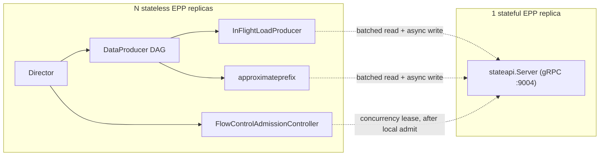

# Shared Scheduling State for Horizontally Scalable EPP (Experimental)

> [!WARNING]
> Feasibility spike for RFC #1593, not a finished feature. Default behavior (`--epp-mode`
> unset) is unchanged. See [Known Limitations](#known-limitations) before relying on this
> beyond local evaluation.

## Overview

Today's EPP deployment is a single active-passive replica set: leader election picks one
Pod to serve `ext-proc` traffic, and every scheduling signal (inflight load, prefix cache,
flow control) lives only in that leader's memory. A leader restart is a real traffic
outage, and throughput is capped at what one process can do.

This introduces `--epp-mode=stateful|stateless`, separating **who serves traffic** from
**who holds shared scheduling state**: N `stateless` replicas serve traffic concurrently
(no leader election), each falling back to a local, classic-equivalent view; one
`stateful` replica holds the fleet-wide view over an internal gRPC State API. See RFC #1593
for the full design discussion.

---

## Key Components

| Component | Role |
|---|---|
| **Stateless EPP** | Serves `ext-proc` traffic, no leader election. Reads/writes shared state through a `StateStore`. |
| **Stateful EPP** | Holds the fleet-wide view. Never serves `ext-proc` traffic; only exposes the State API and health. Single active-passive instance, no sharding path. |
| **State API** (`pkg/epp/statestore/stateapi`) | The gRPC service the stateful EPP exposes, backed by an in-memory `Store` (no eviction). |
| **StateStore** (`pkg/epp/statestore`) | Client-side abstraction: `Local` (in-process, classic-equivalent), `Remote` (forwards to the State API), `FailOpen`/`LocalFallback` (prefers Remote within a timeout, falls back to Local). |
| **ConcurrencyState** | New primitive (`concurrency_lease.go`) for a fleet-wide concurrency cap — the existing `FlowRegistry` counts queue occupancy, not concurrent execution, so it can't serve this role. |

---

## Architecture



Reads stay on the request's critical path (bounded by `--state-api-remote-timeout`,
default 50ms) since a scorer consumes the result immediately. Writes are fire-and-forget:
the local mutation the request depends on already happened synchronously, so a remote
push only affects future requests and never blocks the current one.

Two degradation strategies, chosen per capability: **FailOpen** (inflight, prefix) prefers
the remote read and falls back to local on error/timeout. **LocalFallback** (flow control)
always admits locally first, then requests a fleet-wide lease; on remote failure it falls
back to a local concurrency cap (`--flow-control-local-max-concurrency`) and reports
`Degraded` rather than silently `Admitted`.

---

## Configuration

| Flag | Default | Description |
|---|---|---|
| `--epp-mode` | `classic` | `classic`, `stateful`, or `stateless`. |
| `--state-api-port` | `9004` | State API gRPC port. Stateful mode only. |
| `--stateful-epp-address` | — | `host:port` of the stateful replica. Required in stateless mode. |
| `--state-api-remote-timeout` | `50ms` | Per-call timeout for State API reads/writes. |
| `--flow-control-global-max-concurrency` | `0` (unlimited) | Fleet-wide concurrency cap per flow key. |
| `--flow-control-local-max-concurrency` | `0` (unlimited) | Local fallback cap when the State API is unreachable. |
| `--state-access-mode-inflight` / `-prefix` | `FailOpen` | Or `Local` — never call remote for that capability. |
| `--state-access-mode-flowcontrol` | `LocalFallback` | Or `Local`. |
| `--state-api-artificial-delay` | `0` | Fixed per-call delay, for modeling a real network hop on loopback test clusters. Not a production flag. |

```bash
epp --epp-mode=stateful --state-api-port=9004 --config-file=/etc/epp/epp-config.yaml

epp --epp-mode=stateless --stateful-epp-address=stateful-epp:9004 \
    --config-file=/etc/epp/epp-config.yaml
```

---

## Try It Locally

Not yet wired into `kind-dev-env.sh`'s scenario flags (unlike `DISAGG_E`/`DISAGG_P`). To
try it manually:

1. Add `inflight-load-producer` to your `EndpointPickerConfig`'s plugin list and set
   `featureGates: [flowControl]`. Without both, `--epp-mode` alone won't exercise the
   inflight or flow-control capabilities — only prefix works with the default
   `deploy/config/sim-epp-config.yaml`. This config becomes the `epp-config` ConfigMap
   both the stateless and stateful replicas mount at `/etc/epp/epp-config.yaml`, so one
   copy covers both:

   ```yaml
   # sim-epp-config-stateful.yaml
   apiVersion: llm-d.ai/v1alpha1
   kind: EndpointPickerConfig
   featureGates: [flowControl]
   plugins:
   - type: approx-prefix-cache-producer
     parameters:
       maxPrefixBlocksToMatch: 256
       lruCapacityPerServer: 31250
   - type: inflight-load-producer
   - type: prefix-cache-scorer
   - type: decode-filter
   - type: max-score-picker
   - type: single-profile-handler
   schedulingProfiles:
   - name: default
     plugins:
     - pluginRef: decode-filter
     - pluginRef: max-score-picker
     - pluginRef: prefix-cache-scorer
       weight: 2
   ```

2. `EPP_CONFIG=sim-epp-config-stateful.yaml ./scripts/kind-dev-env.sh` for the classic
   baseline — this is what creates the `epp-config` ConfigMap the next step reuses.
3. Deploy a second EPP Deployment in stateful mode, reusing the image, `ServiceAccount`,
   and `epp-config` ConfigMap the step above already created (no new RBAC needed). Save
   this as `stateful-epp.yaml` and `envsubst < stateful-epp.yaml | kubectl apply -f -`
   (`$EPP_IMAGE`, `$NAMESPACE`, `$POOL_NAME`, `$EPP_NAME` are already exported by
   `kind-dev-env.sh`):

   ```yaml
   apiVersion: apps/v1
   kind: Deployment
   metadata:
     name: stateful-epp
     namespace: ${NAMESPACE}
   spec:
     replicas: 1
     # A single leader-elected replica: RollingUpdate would surge a second pod
     # while the old one is still up, and the new pod can never pass its
     # leader-gated readiness check until the old one is killed, deadlocking
     # the rollout.
     strategy:
       type: Recreate
     selector:
       matchLabels:
         app: stateful-epp
     template:
       metadata:
         labels:
           app: stateful-epp
       spec:
         serviceAccountName: ${EPP_NAME}
         containers:
         - name: epp
           image: ${EPP_IMAGE}
           args:
             - --pool-name
             - "${POOL_NAME}"
             - --pool-namespace
             - "${NAMESPACE}"
             - --config-file
             - "/etc/epp/epp-config.yaml"
             - --epp-mode=stateful
             - --state-api-port=9004
           ports:
           - containerPort: 9003
             name: grpc-health
           - containerPort: 9004
             name: state-api
           # service must be set: an empty/overall-health service name is
           # gated on isLeader and deadlocks a rolling update, since the new
           # pod never turns Ready while the old leader is still up.
           livenessProbe:
             grpc:
               port: 9003
               service: liveness
           readinessProbe:
             grpc:
               port: 9003
               service: readiness
           volumeMounts:
           - name: epp-config
             mountPath: /etc/epp
         volumes:
         - name: epp-config
           configMap:
             name: epp-config
   ---
   apiVersion: v1
   kind: Service
   metadata:
     name: stateful-epp
     namespace: ${NAMESPACE}
   spec:
     selector:
       app: stateful-epp
     ports:
     - name: state-api
       port: 9004
     - name: grpc-health
       port: 9003
   ```

4. Patch the existing Deployment's args to add `--epp-mode=stateless
   --stateful-epp-address=stateful-epp:9004`, then scale it to N replicas:

   ```bash
   kubectl patch deployment "${EPP_NAME}" --type=json -p='[
     {"op":"add","path":"/spec/template/spec/containers/0/args/-","value":"--epp-mode=stateless"},
     {"op":"add","path":"/spec/template/spec/containers/0/args/-","value":"--stateful-epp-address=stateful-epp:9004"}
   ]'
   kubectl scale deployment "${EPP_NAME}" --replicas=3
   ```

5. Before trusting any comparison, confirm `statestore_remote_call_total` is nonzero on
   `:9090/metrics` — an absent metric means the remote path was never exercised, not that
   it never failed (`statestore_remote_fallback_total` gives the failure rate).

---

## Known Limitations

- Single active-passive stateful replica, no sharding path.
- In-memory prefix/inflight stores have no eviction — memory grows unbounded. A Redis- or
  PVC-backed `Store` is future work; `stateapi.Store` is already factored for a drop-in
  replacement.
- Internal State API is plaintext gRPC (no TLS/mTLS).
- The stateful replica's own crash-loop behavior hasn't been fault-injected (only clean
  pod delete-and-replace).

---

## References

- RFC #1593, "Shared Scheduling State for Horizontally Scalable EPP Deployments"
- [Architecture Documentation](./architecture.md)
