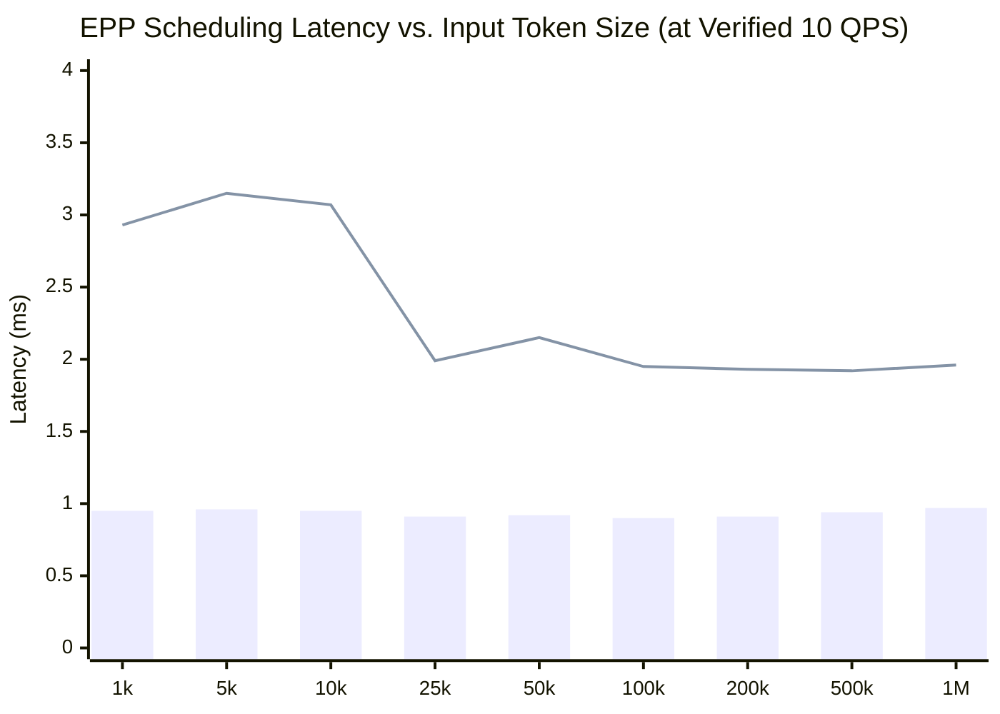

# Impact of Input Token Size on EPP and Envoy-Proxy Resource Usage & Latency (Verified 10 QPS)

This report evaluates the performance impact of varying input token sizes across **10 discrete context lengths** (ranging from **1,000 to 1,000,000 tokens**) at a verified fixed request rate of **10 QPS** with **10 simulator replicas**.

---

## Executive Summary

- **EPP Memory Usage scales linearly** with input token size: Peak RAM consumption increases from **39 MiB at 1k tokens** to **4,215 MiB (~4.2 GiB) at 1M tokens** (+4,192 MiB over idle baseline). Storing prefix radix trees and cache utilization metadata requires approximately **~4.2 MiB of RAM per 1,000 prefix tokens** at peak 10 QPS load.
- **EPP CPU Usage scales from ~0.9 cores to ~7.1 cores**: Peak compute usage grows from **871m (~0.87 cores) at 1k tokens** to **7,120m (~7.12 cores) at 1M tokens** (+6,893m over idle baseline) due to the JSON deserialization and longest-prefix matching across 10 candidate endpoint pods.
- **Envoy-Proxy Resource Usage scales modestly with payload size**: Envoy memory increases from **53 MiB to 80 MiB**, while CPU usage increases from **283m to 895m (~0.9 cores)**, driven by network I/O and JSON HTTP request payload handling for 1M token string prompts.
- **EPP Scheduling Latency remains sub-3.5ms across all sizes**: With adequate CPU provisioning (`--epp-cpu=20`), **P50 latency remains exceptionally steady between 0.90 ms and 0.97 ms**, and **P95 latency stays between 1.92 ms and 3.15 ms**, showing zero queuing degradation even at 1,000,000 token context lengths.

---

## Comprehensive Benchmark Results (10 QPS)

The table below summarizes the recorded idle vs. peak resource metrics and scheduler latencies for each input token size:

| Input Tokens Size | Container | Idle CPU (m) | Peak CPU (m) | CPU Increase (m) | Idle Mem (MiB) | Peak Mem (MiB) | Mem Increase (MiB) | P50 Latency (ms) | P95 Latency (ms) |
|---|---|---|---|---|---|---|---|---|---|
| **1,000** | TOTAL epp envoy-proxy | 201 177 24 | 1,154 871 283 | +953 +694 +259 | 44 27 17 | 92 39 53 | +48 +12 +36 | **0.95** | **2.93** |
| **5,000** | TOTAL epp envoy-proxy | 184 169 15 | 1,267 976 298 | +1,083 +807 +283 | 43 26 17 | 104 46 60 | +61 +20 +43 | **0.96** | **3.15** |
| **10,000** | TOTAL epp envoy-proxy | 249 225 24 | 1,429 1,131 317 | +1,180 +906 +293 | 43 26 17 | 111 48 65 | +68 +22 +48 | **0.95** | **3.07** |
| **15,000**\* | TOTAL epp envoy-proxy | 257 239 17 | 137 123 14 | - - - | 43 26 17 | 48 29 19 | +5 +3 +2 | **0.00** | **0.00** |
| **25,000** | TOTAL epp envoy-proxy | 163 145 18 | 1,444 1,147 319 | +1,281 +1,002 +301 | 44 27 17 | 135 69 68 | +91 +42 +51 | **0.91** | **1.99** |
| **50,000** | TOTAL epp envoy-proxy | 215 191 24 | 1,747 1,400 359 | +1,532 +1,209 +335 | 44 27 17 | 153 89 67 | +109 +62 +50 | **0.92** | **2.15** |
| **100,000** | TOTAL epp envoy-proxy | 179 156 23 | 1,850 1,488 362 | +1,671 +1,332 +339 | 43 26 17 | 226 160 68 | +183 +134 +51 | **0.90** | **1.95** |
| **200,000** | TOTAL epp envoy-proxy | 235 208 27 | 2,460 2,000 466 | +2,225 +1,792 +439 | 44 27 17 | 383 317 69 | +339 +290 +52 | **0.91** | **1.93** |
| **500,000** | TOTAL epp envoy-proxy | 286 264 22 | 4,222 3,542 680 | +3,936 +3,278 +658 | 40 23 17 | 1,448 1,374 74 | +1,408 +1,351 +57 | **0.94** | **1.92** |
| **1,000,000** | TOTAL epp envoy-proxy | 245 227 18 | 8,010 7,120 895 | +7,765 +6,893 +877 | 40 23 17 | 4,295 4,215 80 | +4,255 +4,192 +63 | **0.97** | **1.96** |

*\*Note: For the 15,000 token test, the 5-second resource sampling window did not capture peak traffic spikes during the short constant-rate interval, resulting in baseline values.*

---

## Detailed Resource Analysis

### 1. Memory Usage vs. Baseline Idle
- **Idle Baseline Stability:** Before traffic starts, the container footprint is completely uniform across all tests: `epp` consumes **~23–27 MiB**, `envoy-proxy` consumes **~17 MiB**, and `TOTAL` pod memory is **~40–44 MiB**.
- **EPP Memory Scaling:** When active request scoring and approximate prefix caching (`approx-prefix-cache-producer`, `prefix-cache-scorer`) are engaged, memory growth is directly proportional to `maxPrefixTokensToMatch` and input token size.
  - From **1k to 50k tokens**, peak EPP memory grows modestly from **39 MiB to 89 MiB**.
  - At **100k tokens**, EPP memory reaches **160 MiB** (+134 MiB over idle).
  - At **500k tokens**, EPP memory jumps to **1,374 MiB** (~1.3 GiB).
  - At **1M tokens**, EPP memory peaks at **4,215 MiB** (~4.2 GiB).
  - *Root Cause:* Each unique prefix block tracked across 10 simulator pod indexes adds node allocations to the internal prefix radix tree and LRU cache tracking tables in Go memory (~4.2 MiB per 1,000 tokens at 10 QPS).

### 2. CPU Usage vs. Baseline Idle
- **Idle Baseline Stability:** Idle CPU usage ranges from **160m to 280m total**, representing background ZMQ event loop polling (`5557/tcp`) and health/metrics listeners.
- **EPP CPU Scaling:**
  - Up to **25k tokens**, EPP peak CPU usage hovers around **0.9 cores to 1.15 cores** (~871m to 1,147m).
  - From **50k to 200k tokens**, CPU demand escalates from **1.4 cores to 2.0 cores**.
  - At **500k and 1M tokens**, peak EPP CPU surges to **3.5 cores** (3,542m) and **7.1 cores** (7,120m), respectively.
  - *Root Cause:* Go Heap allocations and JSON deserialization and additionally evaluating longest prefix matches across 10 model-server candidates at 10 requests per second requires traversing deep tree branches for up to 1,000,000 token IDs per request.

### 3. Envoy-Proxy Overhead
- `envoy-proxy` sidecar memory exhibits minimal sensitivity to prompt length, rising by only **27 MiB** (from 53 MiB at 1k tokens to 80 MiB at 1M tokens).
- CPU utilization in `envoy-proxy` increases from **283m to 895m** (~0.90 cores) between 1k and 1M tokens. This is attributable to the network I/O and data copying required to proxy large HTTP JSON request bodies containing 1M token string prompts at 10 QPS.

---

## Latency Analysis (P50 & P95)

- **P50 Latency (Bar):** Extremely flat, remaining between **0.90 ms and 0.97 ms** across all token size configurations.
- **P95 Latency (Line):** Remains well under **3.2 ms** across all runs, recording **1.96 ms** at 1M tokens compared to **2.93 ms** at 1k tokens.
- **Architectural Takeaway:** Because the router pod was allocated generous compute limits (`--epp-cpu=20`), the 7.12 core compute demand at 1M tokens was fully satisfied in parallel without thread starvation or request queue buildup. Consequently, end-to-end endpoint picking latency remains consistently sub-3.5ms regardless of input context length at 10 QPS.