# Comparative Analysis: Impact of Output Token Length on EPP CPU and Memory Usage

This report evaluates the scaling behavior and resource consumption of `llm-d-router` across four discrete output token lengths (**100, 1,000, 5,000, and 10,000 tokens**) at a steady **10 QPS** request rate (`input_tokens_size = 200`) across 10 simulator replicas, comparing two configurations:

1. **`random-only` (`random-default-parsers`)**: Random picking with default request/response body parsers (`openai`, `anthropic`, `vllmhttp`).
2. **`random-passthrough`**: Random picking with `passthrough-parser` (bypasses payload parsing).

---

## Executive Summary

- **Strong Linear CPU Scaling with Output Token Volume:** Increasing output token length from 100 to 10,000 tokens drives a **>6x increase in EPP CPU usage** (from ~0.60 cores up to **3.71 cores** for default parsers). This occurs because Envoy sends an `ext_proc` gRPC call to EPP's `HandleResponseBody` for every single streaming token chunk. Generating 10,000 tokens across 10 QPS produces ~100,000 streaming chunks per second that EPP must process.
- **Substantial CPU Savings with Passthrough-Parser (~0.81 Cores Saved):** At 10,000 output tokens, skipping response chunk parsing with `passthrough-parser` reduces peak EPP CPU from **3.71 cores down to 2.90 cores**—a **21.8% CPU reduction (808m CPU saved)**.
- **Modest Memory Impact (~34 MiB Increase):** Peak EPP memory grows gradually from **~38 MiB at 100 tokens up to 72 MiB at 10,000 tokens**. Because 10,000 output tokens take ~1.0 second to generate, 10 concurrent requests are buffered in flight at 10 QPS, slightly increasing the residency footprint of tracking tables (`PluginState`, `concurrencyTracker`) and streaming buffers.

---

## Side-by-Side Comparison Table

| Output Token Length | Configuration | EPP Peak CPU (m) | EPP Peak Mem (MiB) | Envoy Peak CPU (m) | Envoy Peak Mem (MiB) | P50 Latency (ms) | P95 Latency (ms) |
|---|---|---|---|---|---|---|---|
| **100 Tokens** *(~1k tokens/sec)* | `random-default-parsers` `random-passthrough` | **596** **558** | **38** **37** | **55** **54** | **49** **48** | **0.41** **0.40** | **0.99** **0.98** |
| **1,000 Tokens** *(~10k tokens/sec)* | `random-default-parsers` `random-passthrough` | **1,002** **979** | **40** **40** | **282** **300** | **63** **62** | **0.44** **0.46** | **1.00** **1.00** |
| **5,000 Tokens** *(~50k tokens/sec)* | `random-default-parsers` `random-passthrough` | **2,461** **2,216** | **49** **58** | **1,199** **1,250** | **70** **73** | **0.63** **0.67** | **1.77** **1.73** |
| **10,000 Tokens** *(~100k tokens/sec)* | `random-default-parsers` `random-passthrough` | **3,712** **2,904** | **72** **59** | **2,014** **2,033** | **77** **82** | **0.74** **0.72** | **2.31** **1.82** |

---

## Architectural Insights & Root Causes

```mermaid
xychart-beta
    title "EPP & Envoy Peak CPU Usage vs. Output Token Length (at 10 QPS)"
    x-axis [100 Tokens, 1000 Tokens, 5000 Tokens, 10000 Tokens]
    y-axis "CPU Usage (millicores)" 0 --> 4000
    bar [596, 1002, 2461, 3712]
    bar [558, 979, 2216, 2904]
    bar [55, 282, 1199, 2033]
```

*(Bar 1: EPP `random-default`, Bar 2: EPP `random-passthrough`, Bar 3: Envoy Proxy)*

### 1. Cost of Ext_Proc Response Chunk Streaming
- When Envoy proxies streaming response chunks from target model server pods back to clients, it sends an `ext_proc` gRPC call to EPP's `HandleResponseBody` for every data chunk that arrives over the socket.
- At an output length of **10,000 tokens across 10 QPS**, EPP processes approximately **~100,000 gRPC chunk callbacks per second**.
- On every callback, EPP invokes response body parsers and calls `PluginState.Touch(requestID)` to refresh TTL timers for in-flight request tracking entries. This high-frequency event processing drives EPP CPU usage up from ~0.60 cores (at 100 tokens) to **3.71 cores**.

### 2. The Passthrough Parser Advantage on Output Streams
- Under default settings, EPP executes parser checks (`openai` parser) on incoming response chunks to extract token usage statistics (`usage.completion_tokens`).
- When configured with `passthrough-parser`, EPP completely bypasses chunk content parsing, eliminating JSON validation and string buffer copying across 100,000 chunks/sec.
- This architectural bypass reclaims **808m CPU (~0.81 cores, a 21.8% compute reduction)** at peak 10,000-token streaming volume.

### 3. Envoy Proxy Network I/O Scaling
- Envoy CPU scales linearly with total chunk volume transferred: at 10,000 output tokens, Envoy consumes **~2.03 cores** (up from 0.05 cores at 100 tokens) as its event loop reads, frames, and transmits ~100,000 HTTP/2 chunk frames per second.